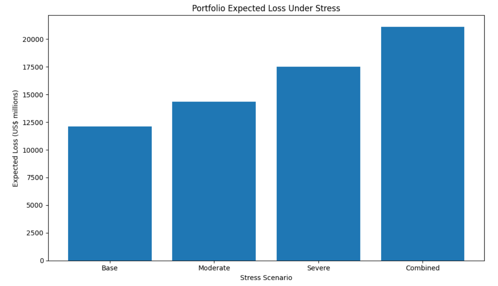
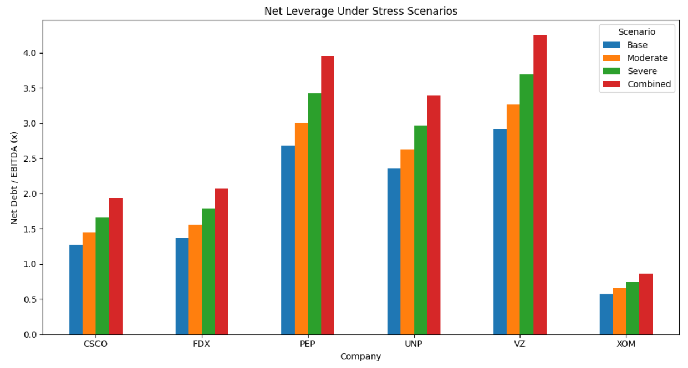

# Corporate Credit Risk & Stress Testing

## Public Company Portfolio Analysis

## Project Visuals

### Portfolio Expected Loss Under Stress

### Net Leverage Under Stress Scenarios

An illustrative corporate credit-risk framework analysing six large US-listed companies across different sectors using FY2025 financial data.

The project combines financial statement analysis, credit metrics, stress testing and expected-loss modelling to examine borrower-level and portfolio-level credit risk.

---

## Project Overview

This project develops a structured credit-risk framework using publicly available financial data from six companies:

- Verizon Communications: Telecommunications
- Exxon Mobil: Energy
- PepsiCo: Consumer Staples
- Cisco Systems: Technology
- Union Pacific: Industrials
- FedEx: Transportation

The analysis examines how financial performance, leverage, liquidity and financing conditions affect corporate credit profiles and how borrower-level risks translate into portfolio-level exposure.

## Why i chose this method
I wanted to use measures that would let me compare the financial strength of companies from very different sectors. Leverage, interest coverage and liquidity gave me a simple way to look at how much debt each company carries, how comfortably it can meet its interest payments and how much short-term financial flexibility it has.

I then used stress testing to see how these measures would change if earnings fell, interest costs increased and cash decreased. Rather than trying to predict whether a company would actually default, I wanted to see how sensitive its credit profile was to a deterioration in its financial position. This felt more appropriate given the small number of companies in the dataset.

I used the PD × LGD × EAD approach to take the analysis one step further and estimate what these credit risks could mean for potential losses across the portfolio. The assumptions are deliberately simple and transparent rather than trying to replicate a bank's internal credit model.

Overall, I chose this approach because it allowed me to move from basic financial statement data to borrower-level risk, stress testing and finally portfolio-level expected losses.

## Analysis

The project covers:

### Credit Metrics
- Gross leverage
- Net leverage
- Interest coverage
- Liquidity coverage

### Credit Resilience
- Relative credit-resilience scoring
- Borrower-level comparison
- Stress sensitivity analysis

### Portfolio Analysis
- Borrower concentration
- Sector exposure
- Portfolio expected loss
- Contribution to expected loss

### Stress Testing

Three adverse scenarios are applied alongside a base case:

- **Moderate:** EBITDA -10%, interest expense +10%, cash -5%
- **Severe:** EBITDA -20%, interest expense +25%, cash -10%
- **Combined:** EBITDA -30%, interest expense +35%, cash -15%

### Expected Loss

Expected loss is estimated using:

**Expected Loss = Probability of Default × Loss Given Default × Exposure at Default**

The model uses an illustrative 40% LGD assumption and total debt as a proxy for EAD.

---

## Data

All financial figures are presented in US$ millions.

---

## My chosen method:

1. Construct a multi-sector corporate debt portfolio
2. Calculate borrower-level credit metrics
3. Assess portfolio concentration and qualitative risks
4. Stress-test financial performance and credit metrics
5. Translate the results into illustrative expected-loss estimates

---

## What I learnt / key bits

The analysis demonstrates several important features of corporate credit risk:

- Simultaneous deterioration in earnings, financing costs and cash can materially weaken credit metrics.
- Portfolio-level risk can remain concentrated even when borrowers operate across different sectors.
- Quantitative ratios need to be considered alongside company-specific and sector-specific qualitative risks.

---

## Future Development:

The model uses a relatively small sample of six companies and a single FY2025 reporting period.

Historical data: Extend the dataset across multiple years to analyse changes in credit quality through different points of the economic cycle.
Market-based measures: Incorporate credit ratings, bond spreads and CDS data where available to compare the model's results with external and market-based measures of credit risk.
Statistical PD modelling: Replace the current illustrative PD bands with probabilities estimated from a larger historical dataset of companies and defaults.
Company-specific stress tests: Replace the uniform stress assumptions with scenarios based on the main risks facing each sector, such as commodity prices for energy companies or economic activity and fuel costs for transportation companies.

---

## Tools used in my analysis

- Python
- pandas
- NumPy
- Matplotlib
- Kaggle Notebooks
